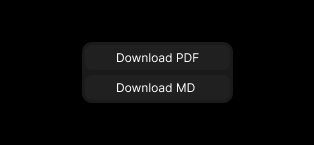

# [TODO] Design the layout from the design/wireframe in codesnippets, divide into react component, with error fallback UI, etc.

- It should contain the final decisions, and layout, no assumptions or decision to taken during development.

## file browser 

- **Width** - 20% (20% can be enough but not if there are a lot of children so font and icon size set small enough to fit at least five children in window but still large enough to be visible )

- **icons** - icons used
    - folder 
    - file 
    folder open (optional)

- **design** - every child will have a border line to left to inprove visual hierarchy

#### lower tab
- **height** - 50px
- **margin** - 15px

--------->
##### Settings

- icon set to left 
- opens the settings menue
##### downloads 

- icon set to left 
- opens popup on click

    

    - frame width - 150
    - padding - 3px
    - gap - 3px
    

## editor

- empty space with "create new file" button if no tab is open

- adds tabs that can be clicked to do specific tasks

## editor tabs 

- **uses blocknote** - renders the doc into a tab in editor usind a blocknote provided editor component.

- **width** - 50%

## ai interface

 - **width** - 30% 

 - **input** 
    - width - full
    - hight - fixed (100px - 150px )
    if empty the cht interface buttons for new chats or privious chats